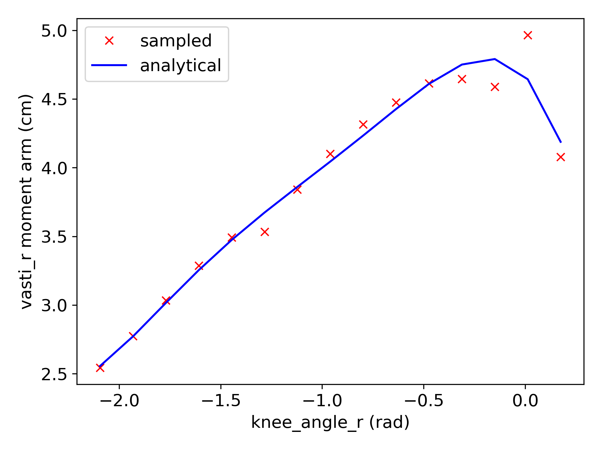
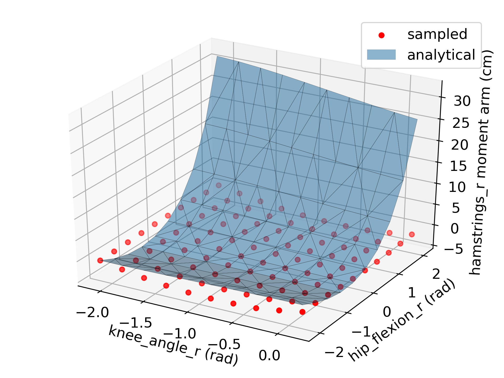

Description
---

This folder contains OpenSim reading utilities and a script for calculating the
feasible joint stiffness for an arbitrary movement. The process is broken into
three steps:

1. Extract the symbolic representation of the muscle moment arm from the OpenSim
   model, where higher order derivatives are required for the calculation of the
   stiffness [script](symbolic_moment_arm.py).
2. Calculate the feasible muscle forces that satisfy the movement under study
   [script](feasible_muscle_forces.py).
3. Calculate the feasible joint stiffness [script](feasible_joint_stiffness.py).

The user can navigate into the corresponding folders and inspect the source
code. The following case study is provided in the form of interactive Jupyter
notebook:

- [Feasible Joint Stiffness](feasible_joint_stiffnss.ipynb) calculates
  the feasible joint stiffness of an OpenSim model during walking

The .html file corresponding to the .ipynb notebook included in the folder
contain the pre-executed results of the demo.

Dependencies
---

- Tested with Python 3.7
- OpenSim v4.0: python wrappings
- sympy: `pip install sympy`
- numpy: `pip install numpy`
- matplotlib: (local copy with fixes that work with Python 3.7)
- multipolyfit: `pip install multipolyfit` for multivariate polynomial fitting
- tqdm: `pip install tqdm` for progress bar
- pycddlib: `pip install pycddlib` for finding the feasible muscle
  force set (not used by default)
- cython: (for pycddlib)
- lrs: can be installed with a package manager (command line tool see
  /lrslib-062 folder)

Symbolic Derivation of the Muscle Moment Arm Matrix (OpenSim v4.0)
---

[OpenSim](https://github.com/opensim-org/opensim-core) is a framework
for modeling and simulation of musculoskeletal systems. The muscle
moment arm is an important variable for evaluating the effectiveness
of a muscle to actuate a particular joint. Calculating the muscle
moment arm requires knowledge of the muscle path and wrapping
surfaces. OpenSim is restricted to evaluate the muscle moment arm at
an arbitrary configuration (e.g., 
with *n* degrees of freedom and *m* muscles), lacking the information
for calculating higher order derivatives (e.g., ).  Visual inspection of the
polynomial fitting is provided below.

Calculation of the Feasible Muscle Forces
---

The calculation of the feasible muscle forces that satisfy the movement and
physiological muscle constraints is based on the method developed in [1].

[1] D. Stanev and K. Moustakas, Modeling musculoskeletal kinematic and dynamic
    redundancy using null space projection, PLoS ONE, 14(1): e0209171,
    Jan. 2019, DOI: https://doi.org/10.1371/journal.pone.0209171

Calculation of the Feasible Joint Stiffness
---

The calculation of the feasible joint stiffness is described in more detailed
[2].

[2] D. Stanev and K. Moustakas, Stiffness Modulation of Redundant
    Musculoskeletal Systems, Journal of Biomechanics}, accepted Jan. 2019

 This work is
licensed under a <a rel="license"
href="http://creativecommons.org/licenses/by/4.0/">Creative Commons Attribution
4.0 International License</a>.
